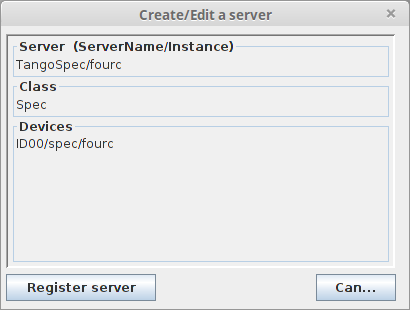

Welcome to TangoSpec’s documentation!
=====================================

TangoSpec is a [TANGO](http://www.tango-controls.org/) device server
which provides a [TANGO](http://www.tango-controls.org/) interface to
[SPEC](http://www.certif.com/).

Getting started
---------------

TangoSpec consists of a [TANGO](http://www.tango-controls.org/) device
server called *TangoSpec*. The device server should contain at least one
device of [TANGO](http://www.tango-controls.org/) class *Spec*.

All other devices (*SpecMotor*, *SpecCounter*) can be created
dynamically on demand by executing commands on the *Spec* device.

This chapter describes how to install, setup, run and customize a new
*TangoSpec* server.

### Download & install

#### Dependencies

TangoSpec [TANGO](http://www.tango-controls.org/) device server depends
on [PyTango](http://www.tinyurl.com/PyTango/) and
[SpecClient\_gevent](https://github.com/mxcube/specclient/) packages.

#### ESRF Production environment

For production environment, use the code from the bliss installer
package called *TangoSpec* (in Control/Tango/Server).

#### Development environment

For development, you can get get the code from ESRF gitlab:

    $ git clone git@gitlab.esrf.fr:andy.gotz/tango-spec.git

### Setup a new TangoSpec server

Go to jive and select *Edit ‣ Create server*. You will get a dialog like
the one below:

The *Server* field should be `TangoSpec/<instance>`{.docutils .literal}
where instance is a name at your choice (usually the name of the spec
session, ex: TangoSpec/fourc).

The *Class* field should be `Spec`{.docutils .literal}.

The *Devices* field should be the
[TANGO](http://www.tango-controls.org/) device name according to the
convention in place at the institute (ex: ID00/spec/fourc).

Press *Register server*.

Select the Server tab, go to node TangoSpec/\<instance\>/Spec/\<device
name\>/properties. Add a new property called Spec by clicking the New
property button. Set the Spec property value to the spec session name
(example: machine01:fourc).

Optional:
:   By default, Spec server will start with auto discovery deactivated.
    This means that motors and counters will **not** be automatically
    added. You can changed this behavior by setting a new property
    called AutoDiscovery and setting it to `True`{.docutils .literal}
    (See [*Auto discovery*](index.html#tangospec-auto-discovery))

Now go to the command line and type (replace *fourc* with your server
instance):

    $ TangoSpec fourc

### Auto discovery

TangoSpec server can run with auto discovery enabled or disabled.

When auto discovery is enabled, every time the TangoSpec server starts
it will synchronize the list of motors and counters with the list
provided by spec. All motors and counters from spec will be
automatically exposed as TANGO devices.

When auto discovery is disabled, tango motors and counters must be
created manually (see [*Expose a
motor*](index.html#tangospec-expose-motor) and [*Expose a
counter*](index.html#tangospec-expose-counter)).

Auto discovery is disabled by default unless you set the
`AutoDiscovery`{.docutils .literal} property of the Spec device has been
set to `True`{.docutils .literal}.

Note

When a Spec TANGO server is running, to switch auto discovery mode, you
need to change the value of the `AutoDiscovery`{.docutils .literal}
**and** execute the `Init`{.docutils .literal} command on the Spec TANGO
device to allow changes to take place.

### Spec session reconstruction

It is possible to synchronize the list of TANGO spec motors and counters
with the list of motors and counters provided by Spec. To do this,
simply execute the [`Reconstruct()`{.xref .py .py-meth .docutils
.literal}](index.html#TangoSpec.Spec.Reconstruct "TangoSpec.Spec.Reconstruct")
command provided by the Spec [TANGO](http://www.tango-controls.org/)
device. After executing this command all motors and counters exported by
[SPEC](http://www.certif.com/) will be present as
[TANGO](http://www.tango-controls.org/) devices. Example:

    >>> import PyTango
    >>> fourc = PyTango.DeviceProxy("ID00/SPEC/fourc")

    # tells you the list of existing spec motors
    >>> fourc.SpecMotorList
    ['energy', 'ffsamy', 'ffsamz', 'istopy', 'istopz']

    >>> # tells you which spec motors are exposed as tango motors
    >>> fourc.MotorList
    []

    >>> fourc.Reconstruct()

    >>> fourc.MotorList
    ['energy (ID00/Spec/energy)',
     'ffsamy (ID00/Spec/ffsamy)',
     'ffsamz (ID00/Spec/ffsamz)',
     'istopy (ID00/Spec/istopy)',
     'istopz (ID00/Spec/istopz)']

    >>> # now there is a Tango device of class SpecMotor for each motor in the spec session:
    >>> energy = PyTango.DeviceProxy("ID00/SPEC/enery")

### Expose a motor

Each motor in [SPEC](http://www.certif.com/) can be represented as a
[TANGO](http://www.tango-controls.org/) device of
[TANGO](http://www.tango-controls.org/) class [`SpecMotor`{.xref .py
.py-class .docutils
.literal}](index.html#TangoSpec.SpecMotor "TangoSpec.SpecMotor").

When you setup a new *TangoSpec* device server it will not export any of
the [SPEC](http://www.certif.com/) motors unless [*auto
discovery*](index.html#tangospec-auto-discovery) is enabled.

To export a [SPEC](http://www.certif.com/) motor to spec just execute
the [TANGO](http://www.tango-controls.org/) command [`AddMotor()`{.xref
.py .py-meth .docutils
.literal}](index.html#TangoSpec.Spec.AddMotor "TangoSpec.Spec.AddMotor")
on the *Spec* device. This can be done in Jive or from a python shell:

    >>> import PyTango
    >>> fourc = PyTango.DeviceProxy("ID00/SPEC/fourc")
    >>> fourc.SpecMotorList
    energy
    ffsamy
    ffsamz
    istopy
    istopz

    >>> # creates a SpecMotor called 'ID00/SPEC/energy' and with alias 'energy'
    >>> fourc.addMotor(["energy"])
    >>> energy = PyTango.DeviceProxy("energy") # or  PyTango.DeviceProxy("ID00/SPEC/energy")

    >>> # creates a SpecMotor called 'a/b/ffsamy' and with alias 'ffsamy'
    >>> fourc.addMotor(["theta", "a/b/ffsamy"])
    >>> theta = PyTango.DeviceProxy("ffsamy") # or  PyTango.DeviceProxy("a/b/ffsamy")

    >>> # creates a SpecMotor called 'a/b/istopy' and with alias 'spec_istopy'
    >>> fourc.addMotor(["istopy", "a/b/istopy", "spec_istopy"])
    >>> phi = PyTango.DeviceProxy("spec_istopy") # or  PyTango.DeviceProxy("a/b/istopy")

### Expose a counter

Each counter in [SPEC](http://www.certif.com/) can be represented as a
[TANGO](http://www.tango-controls.org/) device of
[TANGO](http://www.tango-controls.org/) class [`SpecCounter`{.xref .py
.py-class .docutils
.literal}](index.html#TangoSpec.SpecCounter "TangoSpec.SpecCounter").

When you setup a new *TangoSpec* device server it will not export any of
the [SPEC](http://www.certif.com/) counters unless [*auto
discovery*](index.html#tangospec-auto-discovery) is enabled.

To export a [SPEC](http://www.certif.com/) counter to spec just execute
the [TANGO](http://www.tango-controls.org/) command
[`AddCounter()`{.xref .py .py-meth .docutils
.literal}](index.html#TangoSpec.Spec.AddCounter "TangoSpec.Spec.AddCounter")
on the *TangoSpec* device. This can be done in Jive or from a python
shell:

    >>> import PyTango
    >>> fourc = PyTango.DeviceProxy("ID00/SPEC/fourc")
    >>> fourc.SpecCounterList
    sec
    mon
    det
    c1
    c2
    c3

    >>> # creates a SpecCounter called 'ID00/SPEC/sec' and with alias 'sec'
    >>>
    >>> fourc.addCounter(["sec"])
    >>> sec = PyTango.DeviceProxy("sec") # or  PyTango.DeviceProxy("ID00/SPEC/sec")

    >>> # creates a SpecCounter called 'a/b/sec' and with alias 'sec'
    >>>
    >>> fourc.addCounter(["sec", "a/b/sec"])
    >>> theta = PyTango.DeviceProxy("sec") # or  PyTango.DeviceProxy("a/b/sec")

    >>> # creates a SpecCounter called 'a/b/det' and with alias 'spec_det'
    >>>
    >>> fourc.addCounter(["det", "a/b/det", "spec_det"])
    >>> phi = PyTango.DeviceProxy("specdet") # or  PyTango.DeviceProxy("a/b/det")

### Expose a variable

[SPEC](http://www.certif.com/) variables can be exported to
[TANGO](http://www.tango-controls.org/) as dynamic attributes in the
*TangoSpec* device.

To expose an existing [SPEC](http://www.certif.com/) variable to
[TANGO](http://www.tango-controls.org/) just execute the
[TANGO](http://www.tango-controls.org/) command [`AddVariable()`{.xref
.py .py-meth .docutils
.literal}](index.html#TangoSpec.Spec.AddVariable "TangoSpec.Spec.AddVariable")
on the *TangoSpec* device.

As a result, a new attribute with the same name as the
[SPEC](http://www.certif.com/) variable name will be created in the
*TangoSpec* device.

Example how to expose a [SPEC](http://www.certif.com/) variable called
*FF\_DIR*:

    >>> import PyTango
    >>> fourc = PyTango.DeviceProxy("ID00/SPEC/Fourc")

    >>> # expose a variable called 'FF_DIR'
    >>> fourc.AddVariable("FF_DIR")

Note

Spec sessions can contain literally thousands of variables. For this
reason neither the [*auto
discovery*](index.html#tangospec-auto-discovery) nor the
[`Reconstruct()`{.xref .py .py-meth .docutils
.literal}](index.html#TangoSpec.Spec.Reconstruct "TangoSpec.Spec.Reconstruct")
command will expose spec variables automatically to
[TANGO](http://www.tango-controls.org/)

### Read/Write variables

The new [TANGO](http://www.tango-controls.org/) attribute will a
read-write scalar string. In order to be able to represent proper data
types the string is encoded in [`json`{.xref .py .py-mod .docutils
.literal}](http://docs.python.org/library/json.html#module-json "(in Python v2.7)")
format. In order to read the value of a [SPEC](http://www.certif.com/)
variable you must first decode it from [`json`{.xref .py .py-mod
.docutils
.literal}](http://docs.python.org/library/json.html#module-json "(in Python v2.7)").
Fortunately, [`json`{.xref .py .py-mod .docutils
.literal}](http://docs.python.org/library/json.html#module-json "(in Python v2.7)")
is a well known format. Example how to read the value of a previously
exposed (see chapter above) [SPEC](http://www.certif.com/) variable
called *FF\_DIR* (the variable is an associative array):

    >>> import json
    >>> FF_DIR = json.loads(fourc.FF_DIR)
    >>> FF_DIR
    {u'config': u'/users/homer/Fourc/config',
     u'data': u'/users/homer/Fourc/data',
     u'sample': u'niquel'}

    >>> type(FF_DIR)
    dict

Notice that the value of FF\_DIR is **not** a string but an actual
dictionary.

To write a new value into a [SPEC](http://www.certif.com/) variable the
opposite operation needs to be performed. Example:

    >>> FF_DIR = dict(config="/tmp/config", data="/tmp/data", sample="copper")
    >>> fourc.FF_DIR = json.dumps(FF_DIR)

### Run a macro

To run a macro use the [`ExecuteCmd()`{.xref .py .py-meth .docutils
.literal}](index.html#TangoSpec.Spec.ExecuteCmd "TangoSpec.Spec.ExecuteCmd")
command. Example:

    >>> fourc.ExecuteCmd("wa")

(nothing will be shown because you are not listening to
[SPEC](http://www.certif.com/) output. See [*Listen to
output*](index.html#tangospec-output))

*Quick* macros can be ran using this synchronous method. Macros that
take a long time (ex: ascan) will block the client and eventually a
timeout exception will be raised (default timeout is 3s).

To run long macros there are two options:

#### Run macro asynchronously

Tell the [TANGO](http://www.tango-controls.org/) server to start
executing the macro asynchronously allowing you to do other stuff while
the macro is running. For this use the command [`ExecuteCmdA()`{.xref
.py .py-meth .docutils
.literal}](index.html#TangoSpec.Spec.ExecuteCmdA "TangoSpec.Spec.ExecuteCmdA").

If you are interested you can monitor if the macro as finished
([`IsReplyArrived()`{.xref .py .py-meth .docutils
.literal}](index.html#TangoSpec.Spec.IsReplyArrived "TangoSpec.Spec.IsReplyArrived")
command) and optionaly get the result of it’s execution
([`GetReply()`{.xref .py .py-meth .docutils
.literal}](index.html#TangoSpec.Spec.GetReply "TangoSpec.Spec.GetReply")).
Example:

    >>> ascan_id = fourc.ExecuteCmd("ascan phi 0 90 100 1.0")
    >>> # do my stuff while the ascan is running...

    >>> while not fourc.IsReplyArrived(ascan_id):
    ...     # do more stuff

    >>> ascan_result = fourc.GetReply(ascan_id)

Note

[`GetReply()`{.xref .py .py-meth .docutils
.literal}](index.html#TangoSpec.Spec.GetReply "TangoSpec.Spec.GetReply")
will block until the command finishes.

#### Run macro synchronously

If you want to be blocked until the macro finishes: First, configure the
DeviceProxy timeout to a long time and then execute the macro using the
[`ExecuteCmd()`{.xref .py .py-meth .docutils
.literal}](index.html#TangoSpec.Spec.ExecuteCmd "TangoSpec.Spec.ExecuteCmd")
command:

    >>> fourc.set_timeout_millis(1000*60*60*24*7) # a week
    >>> ascan_result = fourc.ExecuteCmd("ascan phi 0 90 100 1.0")

Just make sure the ascan takes less than a week ;-)

### Move a motor

Todo

write Move a motor chapter

### Count

Todo

write Count chapter

### Listen to output

Todo

write list to output chapter

TangoSpec API
-------------

A [TANGO](http://www.tango-controls.org/) device server which provides a
[TANGO](http://www.tango-controls.org/) interface to
[SPEC](http://www.certif.com/).

 `TangoSpec.`{.descclassname}`run`{.descname}(*\*\*kwargs*)
:   Runs the Spec device server

 *class*`TangoSpec.`{.descclassname}`Spec`{.descname}(*\*args*, *\*\*kwargs*)
:   Bases: `PyTango.server.Device`{.xref .py .py-class .docutils
    .literal}

    A [TANGO](http://www.tango-controls.org/) device server for
    [SPEC](http://www.certif.com/) based on SpecClient.

     `Spec`{.descname}
    :   [TANGO](http://www.tango-controls.org/) device property
        containing spec session name (examples:
        `localhost:spec`{.docutils .literal}, `mach101:fourc`{.docutils
        .literal})

     `AutoDiscovery`{.descname}
    :   [TANGO](http://www.tango-controls.org/) device property (bool)
        describing if auto discovery is enabled or disabled (see: [*Auto
        discovery*](index.html#tangospec-auto-discovery)). Default value
        is `False`{.docutils .literal}.

     `OutputBufferMaxLength`{.descname}
    :   [TANGO](http://www.tango-controls.org/) device property (int)
        describing the output history buffer maximum length (in number
        of output lines). Default is 1000 lines.

     `SpecMotorList`{.descname}
    :   [TANGO](http://www.tango-controls.org/) attribute containning
        the list of all [SPEC](http://www.certif.com/) motors

     `SpecCounterList`{.descname}
    :   [TANGO](http://www.tango-controls.org/) attribute containning
        the list of all [SPEC](http://www.certif.com/) counters

     `MotorList`{.descname}
    :   [TANGO](http://www.tango-controls.org/) attribute containning
        the list of [SPEC](http://www.certif.com/) motors exported to
        [TANGO](http://www.tango-controls.org/)

     `CounterList`{.descname}
    :   [TANGO](http://www.tango-controls.org/) attribute containning
        the list of [SPEC](http://www.certif.com/) counters exported to
        [TANGO](http://www.tango-controls.org/)

     `VariableList`{.descname}
    :   [TANGO](http://www.tango-controls.org/) attribute containning
        the list of [SPEC](http://www.certif.com/) variables exported to
        [TANGO](http://www.tango-controls.org/)

     `Output`{.descname}
    :   [TANGO](http://www.tango-controls.org/) attribute which reports
        [SPEC](http://www.certif.com/) console output (output/tty
        variable)

     `ExecuteCmd`{.descname}(*\*args*, *\*\*kwargs*)
    :   Execute a [SPEC](http://www.certif.com/) command synchronously.
        Use [`ExecuteCmdA()`{.xref .py .py-meth .docutils
        .literal}](index.html#TangoSpec.Spec.ExecuteCmdA "TangoSpec.Spec.ExecuteCmdA")
        instead if you intend to run commands that take some time.

        Parameters:

        **command**
        ([*str*](http://docs.python.org/library/functions.html#str "(in Python v2.7)"))
        – the command to be executed (ex: `"wa"`{.docutils .literal} )

     `ExecuteCmdA`{.descname}(*\*args*, *\*\*kwargs*)
    :   Execute a [SPEC](http://www.certif.com/) command asynchronously.

        Parameters:

        **command**
        ([*str*](http://docs.python.org/library/functions.html#str "(in Python v2.7)"))
        – the command to be executed (ex:
        `"ascan energy 0.1 10 20 0.1"`{.docutils .literal} )

        Returns:

        an identifier for the command.

        Return type:

        int

     `GetReply`{.descname}(*\*args*, *\*\*kwargs*)
    :   Returns the reply of the [SPEC](http://www.certif.com/) command
        given by the cmd\_id, previously requested through
        [`ExecuteCmdA()`{.xref .py .py-meth .docutils
        .literal}](index.html#TangoSpec.Spec.ExecuteCmdA "TangoSpec.Spec.ExecuteCmdA").
        It waits if the command is not finished

        Parameters:

        **cmd\_id**
        ([*int*](http://docs.python.org/library/functions.html#int "(in Python v2.7)"))
        – command identifier

        Returns:

        the reply for the requested command

        Return type:

        str

     `IsReplyArrived`{.descname}(*\*args*, *\*\*kwargs*)
    :   Determines if a command executed previously with the given
        cmd\_id is finished.

        Parameters:

        **cmd\_id**
        ([*int*](http://docs.python.org/library/functions.html#int "(in Python v2.7)"))
        – command identifier

        Returns:

        True if the command response as arrived or False otherwise

        Return type:

        bool

     `AddVariable`{.descname}(*\*args*, *\*\*kwargs*)
    :   Export a [SPEC](http://www.certif.com/) variable to Tango by
        adding a new attribute to this device with the same name as the
        variable.

        Parameters:

        **variable\_name**
        ([*str*](http://docs.python.org/library/functions.html#str "(in Python v2.7)"))
        – [SPEC](http://www.certif.com/) variable name to be exported as
        a [TANGO](http://www.tango-controls.org/) attribute

        Throws PyTango.DevFailed:

         

        If the variable is already exposed in this
        [TANGO](http://www.tango-controls.org/) DS.

     `RemoveVariable`{.descname}(*\*args*, *\*\*kwargs*)
    :   Unexposes the given variable from this
        [TANGO](http://www.tango-controls.org/) DS.

        Parameters:

        **variable\_name**
        ([*str*](http://docs.python.org/library/functions.html#str "(in Python v2.7)"))
        – the name of the [SPEC](http://www.certif.com/) variable to be
        removed

        Throws PyTango.DevFailed:

         

        If the variable is not exposed in this
        [TANGO](http://www.tango-controls.org/) DS

     `AddMotor`{.descname}(*\*args*, *\*\*kwargs*)
    :   Adds a new SpecMotor to this DS.

        *motor\_info* must be a sequence of strings with the following
        options:

            spec_motor_name [, tango_device_name [, tango_alias_name]]

        Examples:

            spec = PyTango.DeviceProxy("ID00/spec/fourc")
            spec.AddMotor(("th",))
            spec.AddMotor(("tth", "ID00/fourc/tth", "theta2"))

        Parameters:

        -   **spec\_motor\_name** – name of the spec motor to export to
            [TANGO](http://www.tango-controls.org/)
        -   **tango\_device\_name** – optional tango name to give to the
            new [TANGO](http://www.tango-controls.org/) motor device
            [default:
            \<tangospec\_domain\>/\<tangospec\_family\>/\<spec\_motor\_name\>]
        -   **tango\_alias\_name** – optional alias to give to the new
            tango motor device [default: \<spec\_motor\_name\>]. Note:
            if the alias exists it will **not** be overwritten.

        Throws PyTango.DevFailed:

         

        If [SPEC](http://www.certif.com/) motor does not exist or if
        motor is already exported

     `RemoveMotor`{.descname}(*\*args*, *\*\*kwargs*)
    :   Removes the given SpecMotor from this DS.

        Parameters:

        **motor\_name**
        ([*str*](http://docs.python.org/library/functions.html#str "(in Python v2.7)"))
        – [SPEC](http://www.certif.com/) motor name to be removed

        Examples:

            spec = PyTango.DeviceProxy("ID00/spec/fourc")
            spec.RemoveMotor("th")

     `AddCounter`{.descname}(*\*args*, *\*\*kwargs*)
    :   Adds a new SpecCounter to this DS.

        *counter\_info* must be a sequence of strings with the following
        options:

            spec_counter_name [, tango_device_name [, tango_alias_name]]

        Examples:

            spec = PyTango.DeviceProxy("ID00/spec/fourc")
            spec.AddCounter(("sec",))
            spec.AddCounter(("det", "ID00/fourc/detector", "detector"))

        Parameters:

        -   **spec\_counter\_name** – name of the spec counter to export
            to [TANGO](http://www.tango-controls.org/)
        -   **tango\_device\_name** – optional tango name to give to the
            new [TANGO](http://www.tango-controls.org/) counter device
            [default:
            \<tangospec\_domain\>/\<tangospec\_family\>/\<spec\_counter\_name\>]
        -   **tango\_alias\_name** – optional alias to give to the new
            tango counter device [default: \<spec\_counter\_name\>].
            Note: if the alias exists it will **not** be overwritten.

        Throws PyTango.DevFailed:

         

        If [SPEC](http://www.certif.com/) counter does not exist or if
        counter is already exported

     `RemoveCounter`{.descname}(*\*args*, *\*\*kwargs*)
    :   Removes the given SpecCounter from this DS.

        Parameters:

        **counter\_name**
        ([*str*](http://docs.python.org/library/functions.html#str "(in Python v2.7)"))
        – [SPEC](http://www.certif.com/) counter name to be removed

        Examples:

            spec = PyTango.DeviceProxy("ID00/spec/fourc")
            spec.RemoveCounter("th")

     `Reconstruct`{.descname}(*\*args*, *\*\*kwargs*)
    :   Exposes to Tango all counters and motors that where found in
        SPEC.

 *class*`TangoSpec.`{.descclassname}`SpecMotor`{.descname}(*cl*, *name*)
:   Bases: `PyTango.server.Device`{.xref .py .py-class .docutils
    .literal}

    A TANGO SPEC motor device based on SpecClient.

     `SpecMotor`{.descname}
    :   [TANGO](http://www.tango-controls.org/) device property
        containing the spec motor mnemonic (examples: `th`{.docutils
        .literal}, `localhost:spec::chi`{.docutils .literal},
        `mach101:fourc::phi`{.docutils .literal}). The full name is only
        required if running the TangoSpec DS without a Spec manager
        device.

     `Position`{.descname}
    :   

    [TANGO](http://www.tango-controls.org/) attribute for the motor user
    position. Setting a value on this attribute will move the motor to
    the specified value.

     `State`{.descname}
    :   

    [TANGO](http://www.tango-controls.org/) attribute for the motor
    state.

    -   INIT - motor initialization phase (startup or through Init
        command)
    -   ON - motor is enabled and stopped.
    -   MOVING - motor is moving
    -   ALARM - motor limit switch is active or position in the alarm
        range
    -   FAULT - connection to [SPEC](http://www.certif.com/) motor lost

     `Status`{.descname}
    :   

    [TANGO](http://www.tango-controls.org/) attribute for the motor
    status.

     `DialPosition`{.descname}
    :   

    [TANGO](http://www.tango-controls.org/) attribute for the motor dial
    position.

     `Sign`{.descname}
    :   

    [TANGO](http://www.tango-controls.org/) attribute for the motor
    sign.

     `Offset`{.descname}
    :   

    [TANGO](http://www.tango-controls.org/) attribute for the motor
    offset.

     `AcceletationTime`{.descname}
    :   

    [TANGO](http://www.tango-controls.org/) attribute for the motor
    acceleration time (s).

     `Backlash`{.descname}
    :   

    [TANGO](http://www.tango-controls.org/) attribute for the motor
    backlash.

     `StepSize`{.descname}
    :   

    [TANGO](http://www.tango-controls.org/) attribute for the current
    step size (used by the StepDown and StepUp commands).

     `Limit_Switches`{.descname}
    :   

    [TANGO](http://www.tango-controls.org/) attribute for the motor
    limit switches (home, upper, lower).

     `Init`{.descname}()
    :   

    Initializes the [TANGO](http://www.tango-controls.org/) motor

     `Stop`{.descname}(*\*args*, *\*\*kwargs*)
    :   Stop the motor (allowing deceleration time)

     `Abort`{.descname}(*\*args*, *\*\*kwargs*)
    :   Stop the motor immediately

     `Move`{.descname}(*\*args*, *\*\*kwargs*)
    :   Move the motor to the given absolute position

        Parameters:

        **abs\_position**
        ([*float*](http://docs.python.org/library/functions.html#float "(in Python v2.7)"))
        – absolute destination position

     `MoveRelative`{.descname}(*\*args*, *\*\*kwargs*)
    :   Move the motor by the given displacement.

        Parameters:

        **rel\_position**
        ([*float*](http://docs.python.org/library/functions.html#float "(in Python v2.7)"))
        – displacement

     `StepUp`{.descname}(*\*args*, *\*\*kwargs*)
    :   Move the motor up by the currently configured step size

     `StepDown`{.descname}(*\*args*, *\*\*kwargs*)
    :   Move the motor down by the currently configured step size

 *class*`TangoSpec.`{.descclassname}`SpecCounter`{.descname}(*cl*, *name*)
:   Bases: `PyTango.server.Device`{.xref .py .py-class .docutils
    .literal}

    A TANGO SPEC counter device based on SpecClient.

     `SpecCounter`{.descname}
    :   [TANGO](http://www.tango-controls.org/) device property
        containing the spec counter mnemonic (examples: `sec`{.docutils
        .literal}, `localhost:spec::det`{.docutils .literal},
        `mach101:fourc::mon`{.docutils .literal}). The full name is only
        required if running the TangoSpec DS without a Spec manager
        device.

     `State`{.descname}
    :   

    [TANGO](http://www.tango-controls.org/) attribute for the counter
    state.

    -   INIT - counter initialization phase (startup or through Init
        command)
    -   ON - counter is enabled and stopped.
    -   RUNNIG - counter is counting
    -   ALARM - counter value in the alarm range
    -   FAULT - connection to [SPEC](http://www.certif.com/) counter
        lost

     `Status`{.descname}
    :   

    [TANGO](http://www.tango-controls.org/) attribute for the counter
    status.

     `Value`{.descname}
    :   

    [TANGO](http://www.tango-controls.org/) attribute for the counter
    value.

     `Init`{.descname}()
    :   

    Initializes the [TANGO](http://www.tango-controls.org/) counter

     `Count`{.descname}(*\*args*, *\*\*kwargs*)
    :   Count by the specified time (s)

        Parameters:

        **count\_time** – count time (s)

     `Stop`{.descname}(*\*args*, *\*\*kwargs*)
    :   Stop counting

     `setEnabled`{.descname}(*\*args*, *\*\*kwargs*)
    :   Enable/Disable counter

        Parameters:

        **enabled**
        ([*bool*](http://docs.python.org/library/functions.html#bool "(in Python v2.7)"))
        – enable or disable

#### Navigation

-   [Documentation Home](index.html#document-index)

#### Versions

-   [PDF version](TangoSpec.pdf)

© Copyright 2014, European Synchrotron Radiation Facility.
