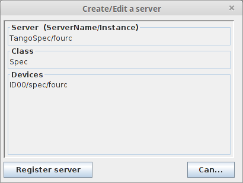

.. _tangospec_getting_started:

================
Getting started
================

TangoSpec consists of a TANGO_ device server called *TangoSpec*. The device
server should contain at least one device of TANGO_ class *Spec*.

All other devices (*SpecMotor*, *SpecCounter*) can be created
dynamically on demand by executing commands on the *Spec* device.

This chapter describes how to install, setup, run and customize a new *TangoSpec*
server.

.. _tangospec_download_install:

Download & install
------------------

Dependencies
~~~~~~~~~~~~

TangoSpec TANGO_ device server depends on PyTango_ and
`SpecClient_gevent <https://github.com/mxcube/specclient/>`_ packages.

ESRF Production environment
~~~~~~~~~~~~~~~~~~~~~~~~~~~

For production environment, use the code from the bliss installer package
called *TangoSpec* (in Control/Tango/Server).

Development environment
~~~~~~~~~~~~~~~~~~~~~~~

For development, you can get the code from ESRF gitlab::

    $ git clone git@gitlab.esrf.fr:spec/tango-spec-ds.git

.. _tangospec_setup:

Setup a new TangoSpec server
----------------------------

Go to jive and select :menuselection:`Edit --> Create server`. You will
get a dialog like the one below:

The *Server* field should be ``TangoSpec/<instance>`` where instance is a name at
your choice (usually the name of the spec session, ex: TangoSpec/fourc).

The *Class* field should be ``Spec``.

The *Devices* field should be the TANGO_ device name according to the convention
in place at the institute (ex: ID00/spec/fourc).

Press *Register server*.

Select the Server tab, go to node TangoSpec/<instance>/Spec/<device name>/properties.
Add a new property called `Spec` by clicking the `New property` button.
Set the `Spec` property value to the spec session name (example: machine01:fourc).

Optional:
    By default, Spec server will start with auto discovery deactivated.
    This means that motors and counters will **not** be automatically added.
    You can changed this behavior by setting a new property called `AutoDiscovery`
    and setting it to ``True`` (See :ref:`tangospec_auto_discovery`)

Now go to the command line and type (replace *fourc* with your server instance)::

    $ TangoSpec fourc

.. _tangospec_auto_discovery:

Auto discovery
--------------

TangoSpec server can run with auto discovery enabled or disabled.

When auto discovery is enabled, every time the TangoSpec server starts it will
synchronize the list of motors and counters with the list provided by spec.
All motors and counters from spec will be automatically exposed as TANGO devices.

When auto discovery is disabled, tango motors and counters must be created manually
(see :ref:`tangospec_expose_motor` and :ref:`tangospec_expose_counter`).

Auto discovery is disabled by default unless you set the ``AutoDiscovery`` property
of the Spec device has been set to ``True``.

.. note::

    When a Spec TANGO server is running, to switch auto discovery mode, you need to
    change the value of the ``AutoDiscovery`` **and** execute the ``Init`` command
    on the Spec TANGO device to allow changes to take place.

Spec session reconstruction
---------------------------

It is possible to synchronize the list of TANGO spec motors and counters with the list
of motors and counters provided by Spec.
To do this, simply execute the :meth:`~TangoSpec.Spec.Reconstruct` command provided
by the Spec TANGO_ device.
After executing this command all motors and counters exported by SPEC_ will be
present as TANGO_ devices. Example::

    >>> import PyTango
    >>> fourc = PyTango.DeviceProxy("ID00/SPEC/fourc")

    # tells you the list of existing spec motors
    >>> fourc.SpecMotorList
    ['energy', 'ffsamy', 'ffsamz', 'istopy', 'istopz']

    >>> # tells you which spec motors are exposed as tango motors
    >>> fourc.MotorList
    []

    >>> fourc.Reconstruct()

    >>> fourc.MotorList
    ['energy (ID00/Spec/energy)',
     'ffsamy (ID00/Spec/ffsamy)',
     'ffsamz (ID00/Spec/ffsamz)',
     'istopy (ID00/Spec/istopy)',
     'istopz (ID00/Spec/istopz)']

    >>> # now there is a Tango device of class SpecMotor for each motor in the spec session:
    >>> energy = PyTango.DeviceProxy("ID00/SPEC/enery")

.. warning::
   this command will expose **all** counters and motors. It is recommended not to execute
   this method when connecting to spec sessions which expose a great number of motors and/or
   counters.

.. _tangospec_expose_motor:

Expose a motor
--------------

Each motor in SPEC_ can be represented as a TANGO_ device of TANGO_ class
:class:`~TangoSpec.SpecMotor`.

When you setup a new *TangoSpec* device server it will not export any of the
SPEC_ motors unless :ref:`auto discovery <tangospec_auto_discovery>` is enabled.

To export a SPEC_ motor to spec just execute the TANGO_ command
:meth:`~TangoSpec.Spec.AddMotor` on the *Spec* device.
This can be done in Jive or from a python shell::

    >>> import PyTango
    >>> fourc = PyTango.DeviceProxy("ID00/SPEC/fourc")
    >>> fourc.SpecMotorList
    energy
    ffsamy
    ffsamz
    istopy
    istopz

    >>> # creates a SpecMotor called 'ID00/SPEC/energy' and with alias 'energy'
    >>> fourc.addMotor(["energy"])
    >>> energy = PyTango.DeviceProxy("energy") # or  PyTango.DeviceProxy("ID00/SPEC/energy")

    >>> # creates a SpecMotor called 'a/b/ffsamy' and with alias 'ffsamy'
    >>> fourc.addMotor(["theta", "a/b/ffsamy"])
    >>> theta = PyTango.DeviceProxy("ffsamy") # or  PyTango.DeviceProxy("a/b/ffsamy")

    >>> # creates a SpecMotor called 'a/b/istopy' and with alias 'spec_istopy'
    >>> fourc.addMotor(["istopy", "a/b/istopy", "spec_istopy"])
    >>> phi = PyTango.DeviceProxy("spec_istopy") # or  PyTango.DeviceProxy("a/b/istopy")

The new motor device will be available **even after the server is restarted**!

.. _tangospec_expose_counter:

Expose a counter
----------------

Each counter in SPEC_ can be represented as a TANGO_ device of TANGO_ class
:class:`~TangoSpec.SpecCounter`.

When you setup a new *TangoSpec* device server it will not export any of the
SPEC_ counters unless :ref:`auto discovery <tangospec_auto_discovery>` is enabled.

To export a SPEC_ counter to spec just execute the TANGO_ command
:meth:`~TangoSpec.Spec.AddCounter` on the *TangoSpec* device.
This can be done in Jive or from a python shell::

    >>> import PyTango
    >>> fourc = PyTango.DeviceProxy("ID00/SPEC/fourc")
    >>> fourc.SpecCounterList
    sec
    mon
    det
    c1
    c2
    c3

    >>> # creates a SpecCounter called 'ID00/SPEC/sec' and with alias 'sec'

    >>> fourc.addCounter(["sec"])
    >>> sec = PyTango.DeviceProxy("sec") # or  PyTango.DeviceProxy("ID00/SPEC/sec")

    >>> # creates a SpecCounter called 'a/b/sec' and with alias 'sec'

    >>> fourc.addCounter(["sec", "a/b/sec"])
    >>> theta = PyTango.DeviceProxy("sec") # or  PyTango.DeviceProxy("a/b/sec")

    >>> # creates a SpecCounter called 'a/b/det' and with alias 'spec_det'

    >>> fourc.addCounter(["det", "a/b/det", "spec_det"])
    >>> phi = PyTango.DeviceProxy("specdet") # or  PyTango.DeviceProxy("a/b/det")

The new counter device will be available **even after the server is restarted**!

.. _tangospec_expose_variable:

Expose a variable
-----------------

SPEC_ variables can be exported to TANGO_ as dynamic attributes in the *TangoSpec*
device.

To expose an existing SPEC_ variable to TANGO_ just execute the TANGO_ command
:meth:`~TangoSpec.Spec.AddVariable` on the *TangoSpec* device.

As a result, a new attribute with the same name as the SPEC_ variable name will
be created in the *TangoSpec* device.

The new attribute will be available **even after the server is restarted**!

The :meth:`~TangoSpec.Spec.AddVariable` expects as argument a :mod:`json` dump of
a python dictionary. The dictionary must contain the *name* key which corresponds
to the spec variable name you want to create. Optionally it can contain the following
keys with the correponding meaning:

    * attr_name: tango attribute name (default is the same as the spec variable name)
    * type: tango attribute type: '[u]int[16,32,64],', 'float[32,64]', 'bool', 'str'.
      Can also be a 1D or 2D array of type (ex: '[float32]' for 1D array of float 32
      bits, '[[uint64]]' for a 2D array of 64 bits unsigned integer). Default is 'json'
      meaning tango attribute is a string where the value is a dump of the spec variable
      value. You should use 'json' for associative arrays or variable which might change
      type.
    * access: tango access ('READ', 'READ_WRITE'). Default is 'READ_WRITE'
    * display_level: tango display level ('OPERATOR', 'EXPERT'). Default is 'OPERATOR'

Example how to expose a SPEC_ variable called *FF_DIR*::

    >>> import json
    >>> import PyTango
    >>> fourc = PyTango.DeviceProxy("ID00/SPEC/Fourc")

    >>> # expose a variable called 'FF_DIR'
    >>> ff_dir_info = dict(name='FF_DIR')
    >>> fourc.AddVariable(json.dumps(ff_dir_info))

    >>> # reading the newly created attribute: by default it is a json
    >>> # encoded string, so we need to decode it first
    >>> value = json.loads(fourc.FF_DIR)
    >>> print(value)
    {u'config': u'/users/homer/Fourc/config',
     u'data': u'/users/homer/Fourc/data',
     u'sample': u'niquel'}'

    >>> # writing: encode first as a string and then send it
    >>> FF_DIR = dict(config="/tmp/config", data="/tmp/data", sample="copper")
    >>> fourc.FF_DIR = json.dumps(FF_DIR)

    >>> # expose an int:
    >>> scan_n_info = dict(name='SCAN_N', type='int32')
    >>> fourc.AddVariable(json.dumps(scan_n_info))
    >>> print(fourc.SCAN_N)
    33

    >>> # expose a 1D double array
    >>> mca_info = dict(name='MCA_DATA', type='[float64]' access='READ')
    >>> fourc.AddVariable(json.dumps(mca_info)

    >>> # Reading yields directly a numpy array
    >>> print(fourc.MCA_DATA)
    array([ 0.,  0.,  0., ...,  0.,  0.,  0.]], dtype=float32)

.. note::

    Spec sessions can contain literally thousands of variables. For this reason
    neither the :ref:`auto discovery <tangospec_auto_discovery>` nor the
    :meth:`~TangoSpec.Spec.Reconstruct` command will expose spec variables
    automatically to TANGO_.

.. _tangospec_run_macro:

Run a macro
-----------

To run a macro use the :meth:`~TangoSpec.Spec.ExecuteCmd` command. Example::

   >>> fourc.ExecuteCmd("wa")

(nothing will be shown because you are not listening to SPEC_ output. See
:ref:`tangospec_output`)

*Quick* macros can be ran using this synchronous method. Macros that take a
long time (ex: ascan) will block the client and eventually a timeout exception
will be raised (default timeout is 3s).

To run long macros there are two options:

Run macro asynchronously
~~~~~~~~~~~~~~~~~~~~~~~~

Tell the TANGO_ server to start executing the macro asynchronously allowing
you to do other stuff while the macro is running. For this use the command
:meth:`~TangoSpec.Spec.ExecuteCmdA`.

If you are interested you can monitor if the macro as finished
(:meth:`~TangoSpec.Spec.IsReplyArrived` command) and optionaly
get the result of it's execution (:meth:`~TangoSpec.Spec.GetReply`).
Example::

   >>> ascan_id = fourc.ExecuteCmd("ascan phi 0 90 100 1.0")
   >>> # do my stuff while the ascan is running...

   >>> while not fourc.IsReplyArrived(ascan_id):
   ...     # do more stuff

   >>> ascan_result = fourc.GetReply(ascan_id)

.. note::

     :meth:`~TangoSpec.Spec.GetReply` will block until the command
     finishes.

Run macro synchronously
~~~~~~~~~~~~~~~~~~~~~~~~

If you want to be blocked until the macro finishes:
First, configure the DeviceProxy timeout to a long time and then execute
the macro using the :meth:`~TangoSpec.Spec.ExecuteCmd` command::

    >>> fourc.set_timeout_millis(1000*60*60*24*7) # a week
    >>> ascan_result = fourc.ExecuteCmd("ascan phi 0 90 100 1.0")

Just make sure the ascan takes less than a week ;-)

.. _tangospec_move_motor:

Move a motor
------------

.. todo:: write Move a motor chapter

.. _tangospec_count:

Count
-----

.. todo:: write Count chapter

.. _tangospec_output:

Listen to output
----------------

.. todo:: write list to output chapter
